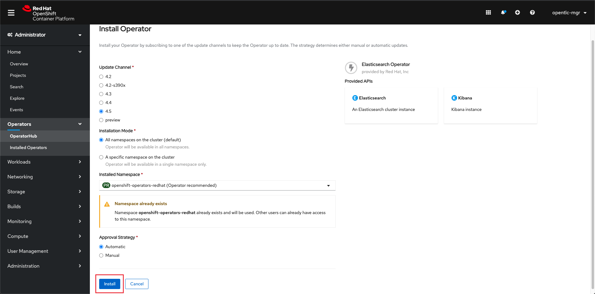
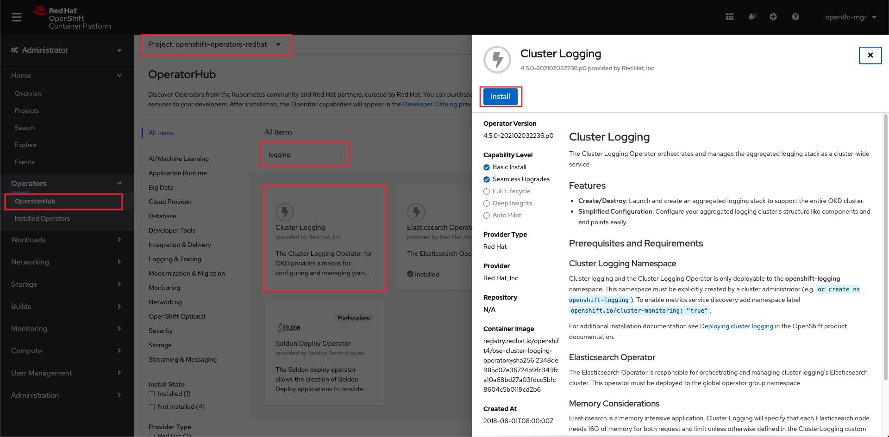
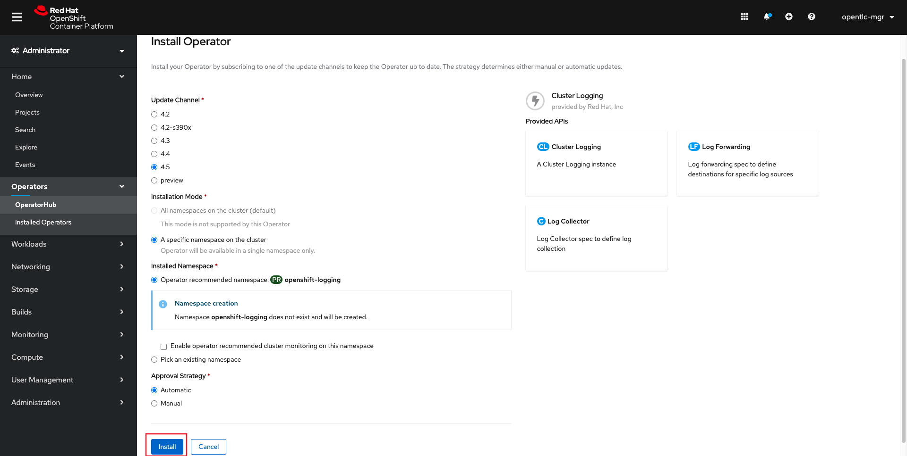
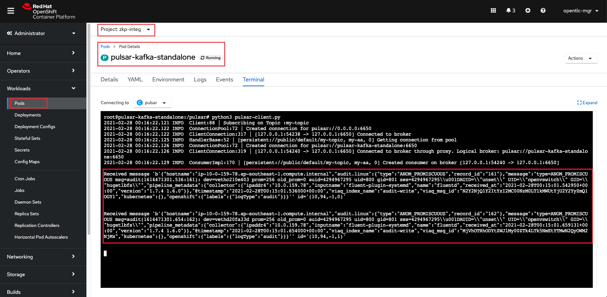

<h1>OpenShift - Cluster Log Forwarding to Apache Pulsar</h1>

Table of Contents

<ul>
<li><a href="#_background">Background</a></li>
<li><a href="#_prerequisites">Prerequisites</a></li>
<li><a href="#_goals">Goals</a></li>
<li><a href="#_steps">Steps</a></li>
</ul>

<h2 id="_background">Background</h2>

Red Hat OpenShift&nbsp;is an open-source container application platform based on the Kubernetes container orchestrator for enterprise application development and deployment. This article will be showing procedure on how to forward logs from&nbsp;<a href="https://www.openshift.com/products/container-platform" target="_blank" rel="noopener noreferrer">Openshift Container Platform</a>&nbsp; to Apache Pulsar via Kafka.&nbsp;

<h2 id="_prerequisites">Prerequisites</h2>

<strong>Tools</strong>

The tools you need locally:

<ul>
<li>

Access to Red Hat OpenShift platform 4.6+

</li>
<li>oc - OpenShift Command Line Interface (CLI) - Available from&nbsp;OpenShift cluster (See image below)</li>
<li>

Access to command line

</li>
<li>

A browser (Chrome, Firefox)

</li>
</ul>

<strong>OpenShift command line tool download:</strong>

<strong>Skills</strong>

<ul>
<li>

Familiarity with Red Hat OpenShift Platform and Operators.

</li>
<li>

Familitrity with the OC Command

</li>
</ul>

<h2 id="_goals">Goals</h2>

<ul>
<li>

Install ElasticSearch operator

</li>
<li>

Install Cluster Logging operator

</li>
<li>

Create a ClusterLogging and ClustarLogForwarder instance

</li>
<li>

Deploy Kafka, Zookeeper and Pulsar instances running on the OpenShift Platform

</li>
<li>Run the Pulsar client to receive the messages from Kafka topic</li>
</ul>

&nbsp;

<h2 id="_steps">Steps</h2>

<ul>
<li>

Provision a Red Hat OpenShift platform

</li>
<li>

Install the Elasticsearch Operator (from the UI)

</li>
</ul>

<ul>
<li>

Install the ClusterLogging Operator

</li>
</ul>

<ul>
<li>

Download the scripts to a folder (all teh yml files)

</li>
<li>

Go to command line and login to your OpenShift cluster

</li>
<li>

Execute the following Commands in sequence from teh folder where you have downloaded the scripts

<ul>
<li>oc apply -f kafka-pulsar-integration.yml</li>
<li>oc apply -f ClusterLogging.yml</li>
<li>oc apply -f ClusterLogForwarder.yml</li>
</ul>
</li>
</ul>

<ul>
<li>

The Kafka, Zookeeper and the Pulsar Pod's are provisioned in the <strong>zkp-integ</strong> projec

</li>
<li>Go to the <strong>zkp-integ project</strong> --&gt; <strong>pulsar-kafka-standalone pod</strong> --&gt; <strong>Terminal Tab&nbsp;</strong></li>
<li>

Under the /pulsar folder run the python pulsar listener application to see the logs coming from OpenShift into pulsar via kafka

</li>

<li>Below is the pulsar client code to display the message on the terminal</li>
</ul>

&nbsp;

